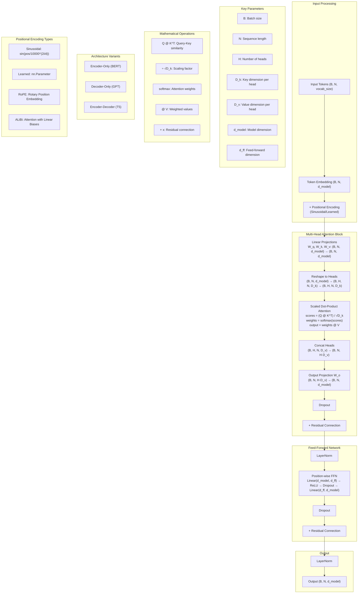

# Advanced Text Transformer Architecture Flowchart

```mermaid
flowchart TD
    subgraph "Input Processing"
        TOK["Input Tokens (B, N, vocab_size)"] --> EMB["Token Embedding (B, N, d_model)"]
        EMB --> PE["+ Positional Encoding<br/>(Sinusoidal/Learned)"]
    end
    
    subgraph "Multi-Head Attention Block"
        PE --> WQKV["Linear Projections<br/>W_q, W_k, W_v: (B, N, d_model) → (B, N, d_model)"]
        WQKV --> SPLIT["Reshape to Heads<br/>(B, N, d_model) → (B, H, N, D_k) → (B, H, N, D_k)"]
        SPLIT --> ATTN["Scaled Dot-Product Attention<br/>scores = (Q @ K^T) / √D_k<br/>weights = softmax(scores)<br/>output = weights @ V"]
        ATTN --> CAT["Concat Heads<br/>(B, H, N, D_v) → (B, N, H·D_v)"]
        CAT --> WO["Output Projection W_o<br/>(B, N, H·D_v) → (B, N, d_model)"]
        WO --> DROP1["Dropout"]
        DROP1 --> ADD1["+ Residual Connection"]
    end
    
    subgraph "Feed-Forward Network"
        ADD1 --> NORM1["LayerNorm"]
        NORM1 --> FFN["Position-wise FFN<br/>Linear(d_model, d_ff) → ReLU → Dropout → Linear(d_ff, d_model)"]
        FFN --> DROP2["Dropout"]
        DROP2 --> ADD2["+ Residual Connection"]
    end
    
    subgraph "Output"
        ADD2 --> NORM2["LayerNorm"]
        NORM2 --> OUT["Output (B, N, d_model)"]
    end
    
    subgraph "Key Parameters"
        B["B: Batch size"]
        N["N: Sequence length"]
        H["H: Number of heads"]
        D_K["D_k: Key dimension per head"]
        D_V["D_v: Value dimension per head"]
        D_MODEL["d_model: Model dimension"]
        D_FF["d_ff: Feed-forward dimension"]
    end
    
    subgraph "Mathematical Operations"
        QKT["Q @ K^T: Query-Key similarity"]
        SCALE["÷ √D_k: Scaling factor"]
        SOFTMAX["softmax: Attention weights"]
        ATTEND["@ V: Weighted values"]
        RESIDUAL["+ x: Residual connection"]
    end
    
    subgraph "Architecture Variants"
        ENC_ONLY["Encoder-Only (BERT)"]
        DEC_ONLY["Decoder-Only (GPT)"]
        ENC_DEC["Encoder-Decoder (T5)"]
    end
    
    subgraph "Positional Encoding Types"
        SINUSOIDAL["Sinusoidal: sin(pos/10000^(2i/d))"]
        LEARNED["Learned: nn.Parameter"]
        ROPE["RoPE: Rotary Position Embedding"]
        ALIBI["ALiBi: Attention with Linear Biases"]
    end
```
