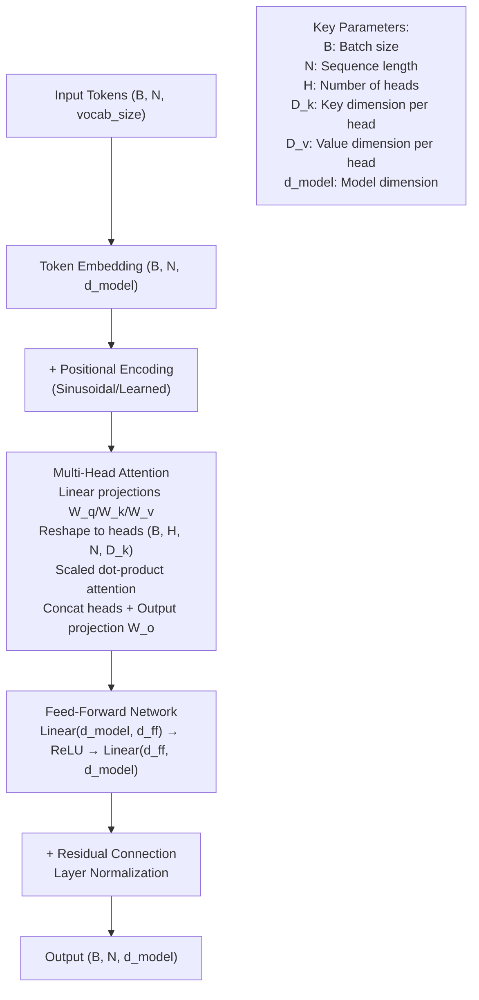

# Text Transformers Flowchart

```mermaid
flowchart TD
    A["Input Tokens (B, N, vocab_size)"] --> B["Token Embedding (B, N, d_model)"]
    B --> C["+ Positional Encoding\n(Sinusoidal/Learned)"]
    C --> D["Multi-Head Attention\nLinear projections W_q/W_k/W_v\nReshape to heads (B, H, N, D_k)\nScaled dot-product attention\nConcat heads + Output projection W_o"]
    D --> E["Feed-Forward Network\nLinear(d_model, d_ff) → ReLU → Linear(d_ff, d_model)"]
    E --> F["+ Residual Connection\nLayer Normalization"]
    F --> G["Output (B, N, d_model)"]
    
    H["Key Parameters:\nB: Batch size\nN: Sequence length\nH: Number of heads\nD_k: Key dimension per head\nD_v: Value dimension per head\nd_model: Model dimension"]
```
