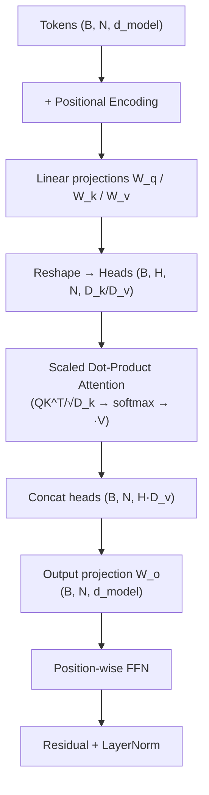

# Text Transformer Block Flowchart

```mermaid
flowchart TD
    X["Tokens (B, N, d_model)"] --> PE["+ Positional Encoding"]
    PE --> WQKV["Linear projections W_q / W_k / W_v"]
    WQKV --> SPLIT["Reshape → Heads (B, H, N, D_k/D_v)"]
    SPLIT --> ATTN["Scaled Dot-Product Attention\n(QK^T/√D_k → softmax → ·V)"]
    ATTN --> CAT["Concat heads (B, N, H·D_v)"]
    CAT --> WO["Output projection W_o\n(B, N, d_model)"]
    WO --> FFN["Position-wise FFN"]
    FFN --> RESNORM["Residual + LayerNorm"]
```
