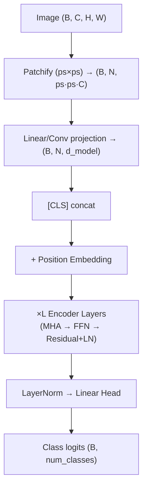

# Vision Transformer Block Flowchart

```mermaid
flowchart TD
    IMG["Image (B, C, H, W)"] --> PATCH["Patchify (ps×ps) → (B, N, ps·ps·C)"]
    PATCH --> PROJ["Linear/Conv projection → (B, N, d_model)"]
    PROJ --> CLS["[CLS] concat"]
    CLS --> POS["+ Position Embedding"]
    POS --> ENCL["×L Encoder Layers\n(MHA → FFN → Residual+LN)"]
    ENCL --> HEAD["LayerNorm → Linear Head"]
    HEAD --> LOGITS["Class logits (B, num_classes)"]
```
