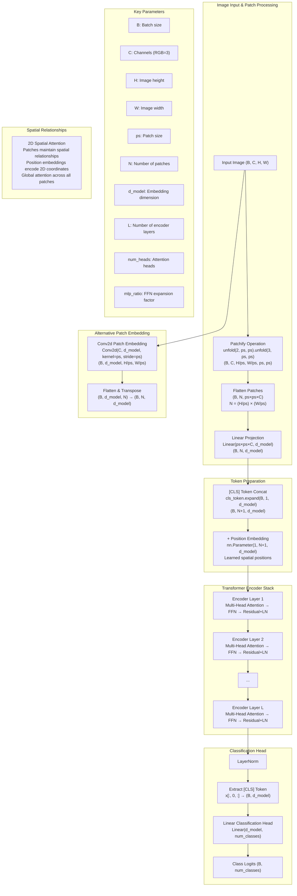

# Vision Transformer Block Flowchart

```mermaid
flowchart TD
    subgraph "Image Input & Patch Processing"
        IMG["Input Image (B, C, H, W)"] --> PATCH["Patchify Operation<br/>unfold(2, ps, ps).unfold(3, ps, ps)<br/>(B, C, H/ps, W/ps, ps, ps)"]
        PATCH --> FLAT["Flatten Patches<br/>(B, N, ps×ps×C)<br/>N = (H/ps) × (W/ps)"]
        FLAT --> PROJ["Linear Projection<br/>Linear(ps×ps×C, d_model)<br/>(B, N, d_model)"]
    end
    
    subgraph "Token Preparation"
        PROJ --> CLS["[CLS] Token Concat<br/>cls_token.expand(B, 1, d_model)<br/>(B, N+1, d_model)"]
        CLS --> POS["+ Position Embedding<br/>nn.Parameter(1, N+1, d_model)<br/>Learned spatial positions"]
    end
    
    subgraph "Transformer Encoder Stack"
        POS --> ENC1["Encoder Layer 1<br/>Multi-Head Attention → FFN → Residual+LN"]
        ENC1 --> ENC2["Encoder Layer 2<br/>Multi-Head Attention → FFN → Residual+LN"]
        ENC2 --> ENC3["..."]
        ENC3 --> ENCL["Encoder Layer L<br/>Multi-Head Attention → FFN → Residual+LN"]
    end
    
    subgraph "Classification Head"
        ENCL --> NORM["LayerNorm"]
        NORM --> EXTRACT["Extract [CLS] Token<br/>x[:, 0, :] → (B, d_model)"]
        EXTRACT --> HEAD["Linear Classification Head<br/>Linear(d_model, num_classes)"]
        HEAD --> LOGITS["Class Logits (B, num_classes)"]
    end
    
    subgraph "Alternative Patch Embedding"
        IMG --> CONV["Conv2d Patch Embedding<br/>Conv2d(C, d_model, kernel=ps, stride=ps)<br/>(B, d_model, H/ps, W/ps)"]
        CONV --> FLAT2["Flatten & Transpose<br/>(B, d_model, N) → (B, N, d_model)"]
    end
    
    subgraph "Key Parameters"
        B["B: Batch size"]
        C["C: Channels (RGB=3)"]
        H["H: Image height"]
        W["W: Image width"]
        PS["ps: Patch size"]
        N["N: Number of patches"]
        D_MODEL["d_model: Embedding dimension"]
        L["L: Number of encoder layers"]
        HEADS["num_heads: Attention heads"]
        MLP_RATIO["mlp_ratio: FFN expansion factor"]
    end
    
    subgraph "Spatial Relationships"
        SPATIAL["2D Spatial Attention<br/>Patches maintain spatial relationships<br/>Position embeddings encode 2D coordinates<br/>Global attention across all patches"]
    end
```
