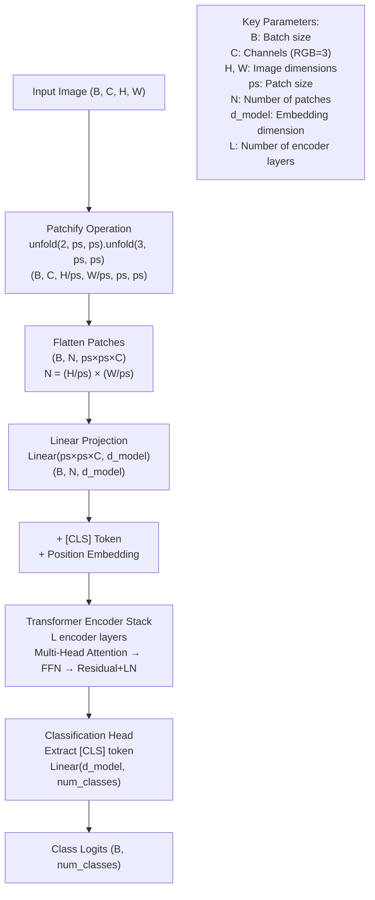

# Vision Transformers Flowchart

```mermaid
flowchart TD
    A["Input Image (B, C, H, W)"] --> B["Patchify Operation\nunfold(2, ps, ps).unfold(3, ps, ps)\n(B, C, H/ps, W/ps, ps, ps)"]
    B --> C["Flatten Patches\n(B, N, ps×ps×C)\nN = (H/ps) × (W/ps)"]
    C --> D["Linear Projection\nLinear(ps×ps×C, d_model)\n(B, N, d_model)"]
    D --> E["+ [CLS] Token\n+ Position Embedding"]
    E --> F["Transformer Encoder Stack\nL encoder layers\nMulti-Head Attention → FFN → Residual+LN"]
    F --> G["Classification Head\nExtract [CLS] token\nLinear(d_model, num_classes)"]
    G --> H["Class Logits (B, num_classes)"]
    
    I["Key Parameters:\nB: Batch size\nC: Channels (RGB=3)\nH, W: Image dimensions\nps: Patch size\nN: Number of patches\nd_model: Embedding dimension\nL: Number of encoder layers"]
```
