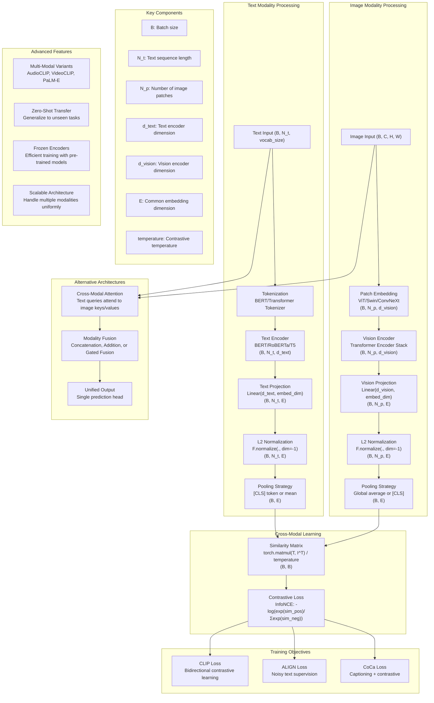

# Advanced Multimodal Transformer Architecture Flowchart

```mermaid
flowchart TD
    subgraph "Text Modality Processing"
        TXT["Text Input (B, N_t, vocab_size)"] --> TOK["Tokenization\nBERT/Transformer Tokenizer"]
        TOK --> TE["Text Encoder\nBERT/RoBERTa/T5\n(B, N_t, d_text)"]
        TE --> TP["Text Projection\nLinear(d_text, embed_dim)\n(B, N_t, E)"]
        TP --> TNORM["L2 Normalization\nF.normalize(., dim=-1)\n(B, N_t, E)"]
        TNORM --> TPOOL["Pooling Strategy\n[CLS] token or mean\n(B, E)"]
    end
    
    subgraph "Image Modality Processing"
        IMG["Image Input (B, C, H, W)"] --> PATCH["Patch Embedding\nViT/Swin/ConvNeXt\n(B, N_p, d_vision)"]
        PATCH --> IE["Vision Encoder\nTransformer Encoder Stack\n(B, N_p, d_vision)"]
        IE --> IP["Vision Projection\nLinear(d_vision, embed_dim)\n(B, N_p, E)"]
        IP --> INORM["L2 Normalization\nF.normalize(., dim=-1)\n(B, N_p, E)"]
        INORM --> IPOOL["Pooling Strategy\nGlobal average or [CLS]\n(B, E)"]
    end
    
    subgraph "Cross-Modal Learning"
        TPOOL --> SIM["Similarity Matrix\ntorch.matmul(T, I^T) / temperature\n(B, B)"]
        IPOOL --> SIM
        SIM --> CONTRAST["Contrastive Loss\nInfoNCE: -log(exp(sim_pos)/Σexp(sim_neg))"]
    end
    
    subgraph "Alternative Architectures"
        TXT --> CROSS["Cross-Modal Attention\nText queries attend to image keys/values"]
        IMG --> CROSS
        CROSS --> FUSION["Modality Fusion\nConcatenation, Addition, or Gated Fusion"]
        FUSION --> UNIFIED["Unified Output\nSingle prediction head"]
    end
    
    subgraph "Training Objectives"
        CONTRAST --> CLIP_LOSS["CLIP Loss\nBidirectional contrastive learning"]
        CONTRAST --> ALIGN_LOSS["ALIGN Loss\nNoisy text supervision"]
        CONTRAST --> COCA_LOSS["CoCa Loss\nCaptioning + contrastive"]
    end
    
    subgraph "Key Components"
        B["B: Batch size"]
        N_T["N_t: Text sequence length"]
        N_P["N_p: Number of image patches"]
        D_TEXT["d_text: Text encoder dimension"]
        D_VISION["d_vision: Vision encoder dimension"]
        E["E: Common embedding dimension"]
        TEMP["temperature: Contrastive temperature"]
    end
    
    subgraph "Advanced Features"
        MULTI["Multi-Modal Variants\nAudioCLIP, VideoCLIP, PaLM-E"]
        ZERO["Zero-Shot Transfer\nGeneralize to unseen tasks"]
        FROZEN["Frozen Encoders\nEfficient training with pre-trained models"]
        SCALE["Scalable Architecture\nHandle multiple modalities uniformly"]
    end
```
