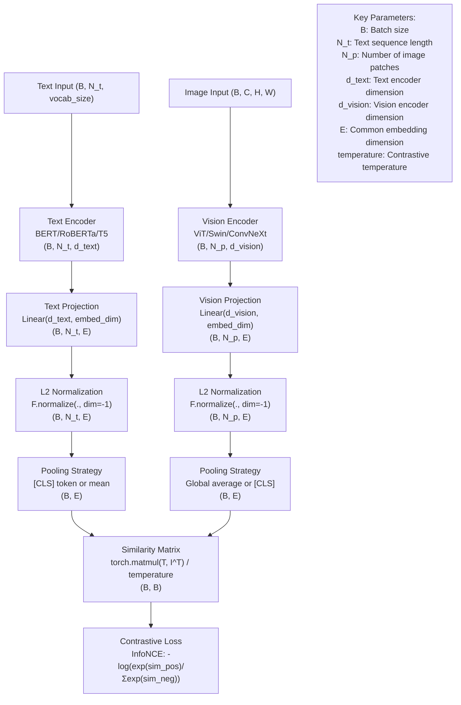

# Multimodal Transformers Flowchart

```mermaid
flowchart TD
    A["Text Input (B, N_t, vocab_size)"] --> B["Text Encoder\nBERT/RoBERTa/T5\n(B, N_t, d_text)"]
    B --> C["Text Projection\nLinear(d_text, embed_dim)\n(B, N_t, E)"]
    C --> D["L2 Normalization\nF.normalize(., dim=-1)\n(B, N_t, E)"]
    D --> E["Pooling Strategy\n[CLS] token or mean\n(B, E)"]
    
    F["Image Input (B, C, H, W)"] --> G["Vision Encoder\nViT/Swin/ConvNeXt\n(B, N_p, d_vision)"]
    G --> H["Vision Projection\nLinear(d_vision, embed_dim)\n(B, N_p, E)"]
    H --> I["L2 Normalization\nF.normalize(., dim=-1)\n(B, N_p, E)"]
    I --> J["Pooling Strategy\nGlobal average or [CLS]\n(B, E)"]
    
    E --> K["Similarity Matrix\ntorch.matmul(T, I^T) / temperature\n(B, B)"]
    J --> K
    K --> L["Contrastive Loss\nInfoNCE: -log(exp(sim_pos)/Σexp(sim_neg))"]
    
    M["Key Parameters:\nB: Batch size\nN_t: Text sequence length\nN_p: Number of image patches\nd_text: Text encoder dimension\nd_vision: Vision encoder dimension\nE: Common embedding dimension\ntemperature: Contrastive temperature"]
```
