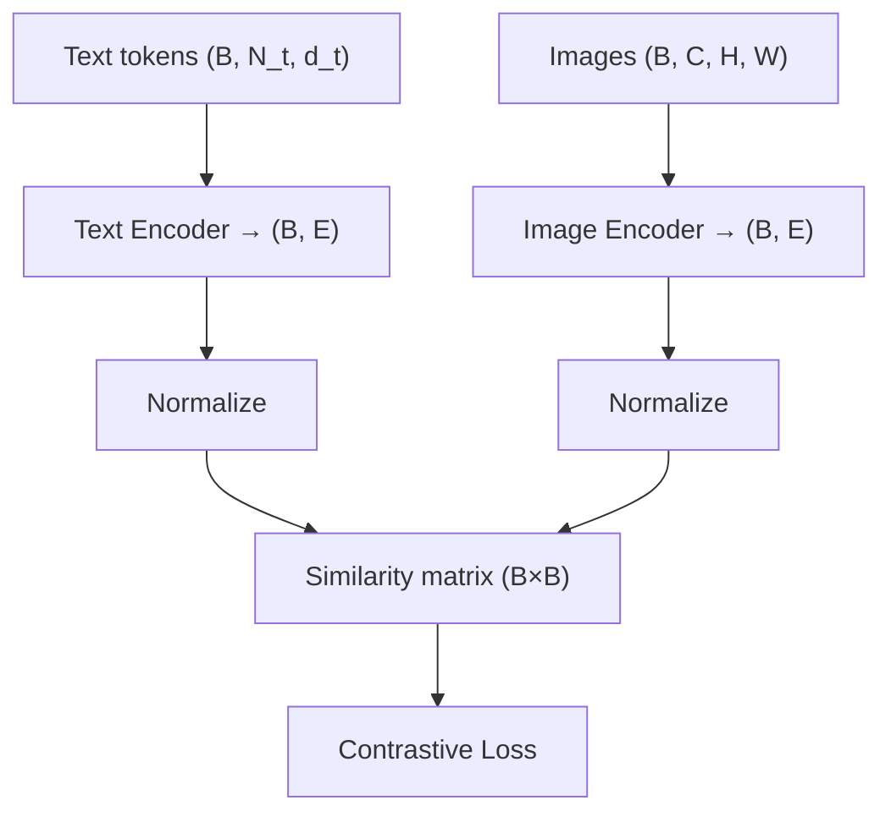

# Multimodal Transformer Block Flowchart

```mermaid
flowchart TD
    TXT["Text tokens (B, N_t, d_t)"] --> TE["Text Encoder → (B, E)"]
    IMG["Images (B, C, H, W)"] --> IE["Image Encoder → (B, E)"]
    TE --> NORM1["Normalize"]
    IE --> NORM2["Normalize"]
    NORM1 --> SIM["Similarity matrix (B×B)"]
    NORM2 --> SIM
    SIM --> LOSS["Contrastive Loss"]
```
