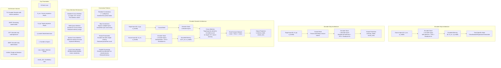

# Advanced Architecture Patterns Flowchart

```mermaid
flowchart TD
    subgraph "Encoder-Only Architecture"
        SRC1["Source Input (B, N_src, d_model)"] --> ENC1["Encoder Stack\nL encoder layers\nSelf-attention + FFN + Residual+LN"]
        ENC1 --> MEM1["Encoded Memory\n(B, N_src, d_model)"]
        MEM1 --> HEAD1["Task-Specific Head\nClassification/Regression/Generation"]
    end
    
    subgraph "Decoder-Only Architecture"
        TGT1["Target Input (B, N_tgt, d_model)"] --> MASK1["Causal Mask\nPrevent attending to future tokens"]
        MASK1 --> DEC1["Decoder Stack\nL decoder layers\nMasked self-attention + FFN + Residual+LN"]
        DEC1 --> OUT1["Output Projection\nLinear(d_model, vocab_size)"]
    end
    
    subgraph "Encoder-Decoder Architecture"
        SRC2["Source Input (B, N_src, d_model)"] --> ENC2["Encoder Stack\nL encoder layers\nSelf-attention + FFN + Residual+LN"]
        ENC2 --> MEM2["Encoded Memory\n(B, N_src, d_model)"]
        TGT2["Target Input (B, N_tgt, d_model)"] --> MASK2["Causal Mask"]
        MASK2 --> DEC2["Decoder Stack\nL decoder layers"]
        DEC2 --> CROSS["Cross-Attention\nTarget queries attend to encoded source\nQ: target, K/V: source memory"]
        MEM2 --> CROSS
        CROSS --> FFN2["Feed-Forward Network\nLinear + ReLU + Linear"]
        FFN2 --> OUT2["Output Projection\nLinear(d_model, vocab_size)"]
    end
    
    subgraph "Connection Patterns"
        RESIDUAL["Residual Connections\nx + sublayer(x)\nGradient flow preservation"]
        SKIP["Skip Connections\nBypass multiple layers\nDenseNet-style connectivity"]
        SHARED["Shared Parameters\nEncoder-decoder weight sharing\nReduced parameter count"]
        PARALLEL["Parallel Processing\nEncoder and decoder run simultaneously\nReduced latency"]
    end
    
    subgraph "Cross-Attention Mechanisms"
        STANDARD["Standard Cross-Attention\nQ: target, K/V: source\nFull attention matrix"]
        MULTI_QUERY["Multi-Query Attention\nShared K/V across heads\nReduced memory usage"]
        SPARSE["Sparse Cross-Attention\nAttend to subset of source\nImproved efficiency"]
        LOCAL["Local Cross-Attention\nWindow-based attention\nLinear complexity"]
    end
    
    subgraph "Key Parameters"
        B["B: Batch size"]
        N_SRC["N_src: Source sequence length"]
        N_TGT["N_tgt: Target sequence length"]
        D_MODEL["d_model: Model dimension"]
        L["L: Number of layers"]
        HEADS["num_heads: Attention heads"]
        VOCAB["vocab_size: Vocabulary size"]
    end
    
    subgraph "Architecture Variants"
        T5["T5: Encoder-Decoder with relative positions"]
        BART["BART: Denoising autoencoder"]
        GPT["GPT: Decoder-only autoregressive"]
        BERT["BERT: Encoder-only bidirectional"]
        UNIFIED["Unified: Single architecture for all tasks"]
    end
```
