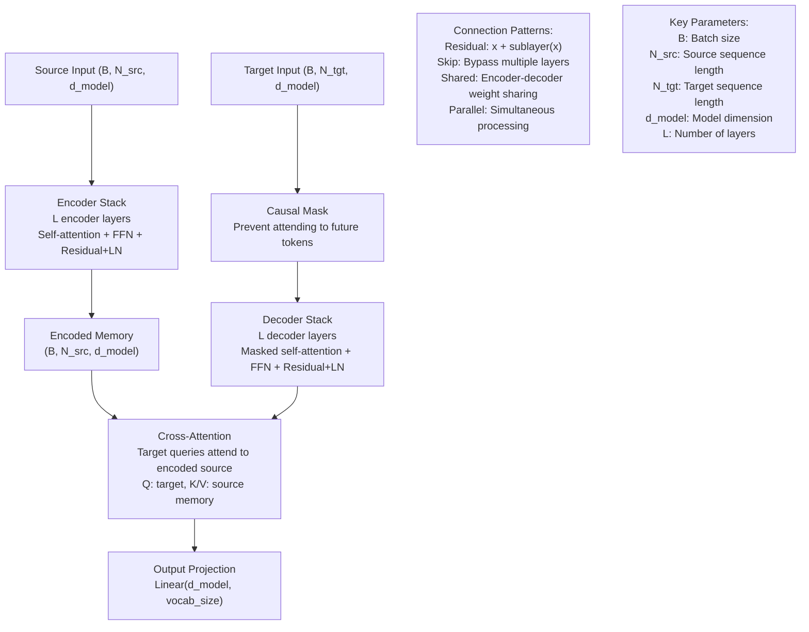

# Architecture Patterns Flowchart

```mermaid
flowchart TD
    A["Source Input (B, N_src, d_model)"] --> B["Encoder Stack\nL encoder layers\nSelf-attention + FFN + Residual+LN"]
    B --> C["Encoded Memory\n(B, N_src, d_model)"]
    
    D["Target Input (B, N_tgt, d_model)"] --> E["Causal Mask\nPrevent attending to future tokens"]
    E --> F["Decoder Stack\nL decoder layers\nMasked self-attention + FFN + Residual+LN"]
    
    C --> G["Cross-Attention\nTarget queries attend to encoded source\nQ: target, K/V: source memory"]
    F --> G
    G --> H["Output Projection\nLinear(d_model, vocab_size)"]
    
    I["Connection Patterns:\nResidual: x + sublayer(x)\nSkip: Bypass multiple layers\nShared: Encoder-decoder weight sharing\nParallel: Simultaneous processing"]
    
    J["Key Parameters:\nB: Batch size\nN_src: Source sequence length\nN_tgt: Target sequence length\nd_model: Model dimension\nL: Number of layers"]
```
