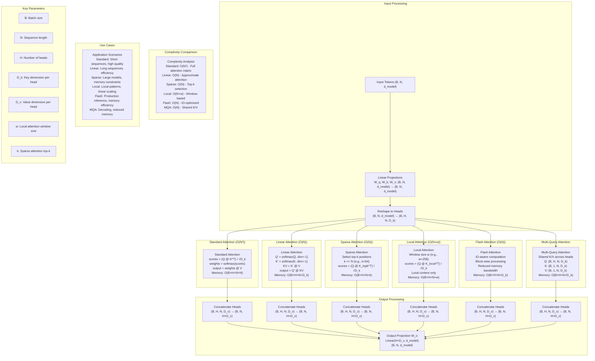

# Advanced Attention Concepts Flowchart

```mermaid
flowchart TD
    subgraph "Input Processing"
        X["Input Tokens (B, N, d_model)"] --> LINEAR["Linear Projections<br/>W_q, W_k, W_v: (B, N, d_model) → (B, N, d_model)"]
        LINEAR --> RESHAPE["Reshape to Heads<br/>(B, N, d_model) → (B, H, N, D_k)"]
    end
    
    subgraph "Standard Attention (O(N²))"
        RESHAPE --> STD["Standard Attention<br/>scores = (Q @ K^T) / √D_k<br/>weights = softmax(scores)<br/>output = weights @ V<br/>Memory: O(B×H×N×N)"]
    end
    
    subgraph "Linear Attention (O(N))"
        RESHAPE --> LIN["Linear Attention<br/>Q' = softmax(Q, dim=-1)<br/>K' = softmax(K, dim=-1)<br/>KV = K' @ V<br/>output = Q' @ KV<br/>Memory: O(B×H×N×D_k)"]
    end
    
    subgraph "Sparse Attention (O(N))"
        RESHAPE --> SPARSE["Sparse Attention<br/>Select top-k positions<br/>k << N (e.g., k=64)<br/>scores = (Q @ K_topk^T) / √D_k<br/>Memory: O(B×H×N×k)"]
    end
    
    subgraph "Local Attention (O(N×w))"
        RESHAPE --> LOCAL["Local Attention<br/>Window size w (e.g., w=256)<br/>scores = (Q @ K_local^T) / √D_k<br/>Local context only<br/>Memory: O(B×H×N×w)"]
    end
    
    subgraph "Flash Attention (O(N))"
        RESHAPE --> FLASH["Flash Attention<br/>IO-aware computation<br/>Block-wise processing<br/>Reduced memory bandwidth<br/>Memory: O(B×H×N×D_k)"]
    end
    
    subgraph "Multi-Query Attention"
        RESHAPE --> MQA["Multi-Query Attention<br/>Shared K/V across heads<br/>Q: (B, H, N, D_k)<br/>K: (B, 1, N, D_k)<br/>V: (B, 1, N, D_k)<br/>Memory: O(B×H×N×D_k)"]
    end
    
    subgraph "Output Processing"
        STD --> CONCAT1["Concatenate Heads<br/>(B, H, N, D_v) → (B, N, H×D_v)"]
        LIN --> CONCAT2["Concatenate Heads<br/>(B, H, N, D_v) → (B, N, H×D_v)"]
        SPARSE --> CONCAT3["Concatenate Heads<br/>(B, H, N, D_v) → (B, N, H×D_v)"]
        LOCAL --> CONCAT4["Concatenate Heads<br/>(B, H, N, D_v) → (B, N, H×D_v)"]
        FLASH --> CONCAT5["Concatenate Heads<br/>(B, H, N, D_v) → (B, N, H×D_v)"]
        MQA --> CONCAT6["Concatenate Heads<br/>(B, H, N, D_v) → (B, N, H×D_v)"]
        
        CONCAT1 --> OUT_PROJ["Output Projection W_o<br/>Linear(H×D_v, d_model)<br/>(B, N, d_model)"]
        CONCAT2 --> OUT_PROJ
        CONCAT3 --> OUT_PROJ
        CONCAT4 --> OUT_PROJ
        CONCAT5 --> OUT_PROJ
        CONCAT6 --> OUT_PROJ
    end
    
    subgraph "Complexity Comparison"
        COMPLEXITY["Complexity Analysis<br/>Standard: O(N²) - Full attention matrix<br/>Linear: O(N) - Approximate attention<br/>Sparse: O(N) - Top-k selection<br/>Local: O(N×w) - Window-based<br/>Flash: O(N) - IO-optimized<br/>MQA: O(N) - Shared K/V"]
    end
    
    subgraph "Use Cases"
        USE_CASES["Application Scenarios<br/>Standard: Short sequences, high quality<br/>Linear: Long sequences, efficiency<br/>Sparse: Large models, memory constraints<br/>Local: Local patterns, linear scaling<br/>Flash: Production inference, memory efficiency<br/>MQA: Decoding, reduced memory"]
    end
    
    subgraph "Key Parameters"
        B["B: Batch size"]
        N["N: Sequence length"]
        H["H: Number of heads"]
        D_K["D_k: Key dimension per head"]
        D_V["D_v: Value dimension per head"]
        W["w: Local attention window size"]
        K["k: Sparse attention top-k"]
    end
```
