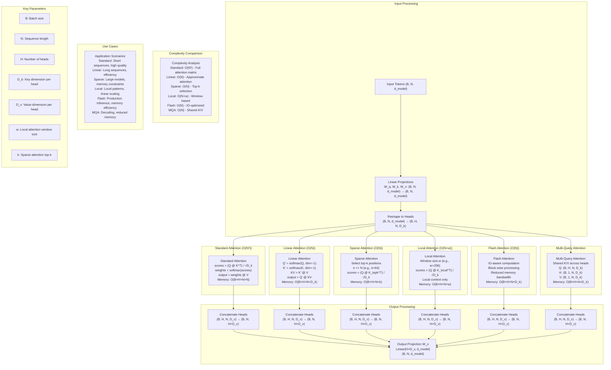

# Advanced Attention Concepts Flowchart

```mermaid
flowchart TD
    subgraph "Input Processing"
        X["Input Tokens (B, N, d_model)"] --> LINEAR["Linear Projections\nW_q, W_k, W_v: (B, N, d_model) → (B, N, d_model)"]
        LINEAR --> RESHAPE["Reshape to Heads\n(B, N, d_model) → (B, H, N, D_k)"]
    end
    
    subgraph "Standard Attention (O(N²))"
        RESHAPE --> STD["Standard Attention\nscores = (Q @ K^T) / √D_k\nweights = softmax(scores)\noutput = weights @ V\nMemory: O(B×H×N×N)"]
    end
    
    subgraph "Linear Attention (O(N))"
        RESHAPE --> LIN["Linear Attention\nQ' = softmax(Q, dim=-1)\nK' = softmax(K, dim=-1)\nKV = K' @ V\noutput = Q' @ KV\nMemory: O(B×H×N×D_k)"]
    end
    
    subgraph "Sparse Attention (O(N))"
        RESHAPE --> SPARSE["Sparse Attention\nSelect top-k positions\nk << N (e.g., k=64)\nscores = (Q @ K_topk^T) / √D_k\nMemory: O(B×H×N×k)"]
    end
    
    subgraph "Local Attention (O(N×w))"
        RESHAPE --> LOCAL["Local Attention\nWindow size w (e.g., w=256)\nscores = (Q @ K_local^T) / √D_k\nLocal context only\nMemory: O(B×H×N×w)"]
    end
    
    subgraph "Flash Attention (O(N))"
        RESHAPE --> FLASH["Flash Attention\nIO-aware computation\nBlock-wise processing\nReduced memory bandwidth\nMemory: O(B×H×N×D_k)"]
    end
    
    subgraph "Multi-Query Attention"
        RESHAPE --> MQA["Multi-Query Attention\nShared K/V across heads\nQ: (B, H, N, D_k)\nK: (B, 1, N, D_k)\nV: (B, 1, N, D_k)\nMemory: O(B×H×N×D_k)"]
    end
    
    subgraph "Output Processing"
        STD --> CONCAT1["Concatenate Heads\n(B, H, N, D_v) → (B, N, H×D_v)"]
        LIN --> CONCAT2["Concatenate Heads\n(B, H, N, D_v) → (B, N, H×D_v)"]
        SPARSE --> CONCAT3["Concatenate Heads\n(B, H, N, D_v) → (B, N, H×D_v)"]
        LOCAL --> CONCAT4["Concatenate Heads\n(B, H, N, D_v) → (B, N, H×D_v)"]
        FLASH --> CONCAT5["Concatenate Heads\n(B, H, N, D_v) → (B, N, H×D_v)"]
        MQA --> CONCAT6["Concatenate Heads\n(B, H, N, D_v) → (B, N, H×D_v)"]
        
        CONCAT1 --> OUT_PROJ["Output Projection W_o\nLinear(H×D_v, d_model)\n(B, N, d_model)"]
        CONCAT2 --> OUT_PROJ
        CONCAT3 --> OUT_PROJ
        CONCAT4 --> OUT_PROJ
        CONCAT5 --> OUT_PROJ
        CONCAT6 --> OUT_PROJ
    end
    
    subgraph "Complexity Comparison"
        COMPLEXITY["Complexity Analysis\nStandard: O(N²) - Full attention matrix\nLinear: O(N) - Approximate attention\nSparse: O(N) - Top-k selection\nLocal: O(N×w) - Window-based\nFlash: O(N) - IO-optimized\nMQA: O(N) - Shared K/V"]
    end
    
    subgraph "Use Cases"
        USE_CASES["Application Scenarios\nStandard: Short sequences, high quality\nLinear: Long sequences, efficiency\nSparse: Large models, memory constraints\nLocal: Local patterns, linear scaling\nFlash: Production inference, memory efficiency\nMQA: Decoding, reduced memory"]
    end
    
    subgraph "Key Parameters"
        B["B: Batch size"]
        N["N: Sequence length"]
        H["H: Number of heads"]
        D_K["D_k: Key dimension per head"]
        D_V["D_v: Value dimension per head"]
        W["w: Local attention window size"]
        K["k: Sparse attention top-k"]
    end
```
