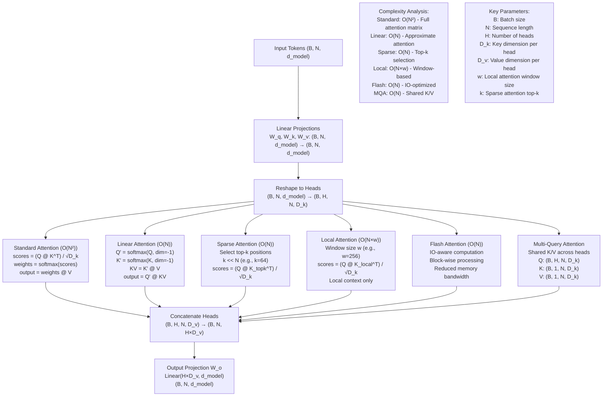

# Advanced Attention Concepts Flowchart

```mermaid
flowchart TD
    A["Input Tokens (B, N, d_model)"] --> B["Linear Projections\nW_q, W_k, W_v: (B, N, d_model) → (B, N, d_model)"]
    B --> C["Reshape to Heads\n(B, N, d_model) → (B, H, N, D_k)"]
    
    C --> D["Standard Attention (O(N²))\nscores = (Q @ K^T) / √D_k\nweights = softmax(scores)\noutput = weights @ V"]
    
    C --> E["Linear Attention (O(N))\nQ' = softmax(Q, dim=-1)\nK' = softmax(K, dim=-1)\nKV = K' @ V\noutput = Q' @ KV"]
    
    C --> F["Sparse Attention (O(N))\nSelect top-k positions\nk << N (e.g., k=64)\nscores = (Q @ K_topk^T) / √D_k"]
    
    C --> G["Local Attention (O(N×w))\nWindow size w (e.g., w=256)\nscores = (Q @ K_local^T) / √D_k\nLocal context only"]
    
    C --> H["Flash Attention (O(N))\nIO-aware computation\nBlock-wise processing\nReduced memory bandwidth"]
    
    C --> I["Multi-Query Attention\nShared K/V across heads\nQ: (B, H, N, D_k)\nK: (B, 1, N, D_k)\nV: (B, 1, N, D_k)"]
    
    D --> J["Concatenate Heads\n(B, H, N, D_v) → (B, N, H×D_v)"]
    E --> J
    F --> J
    G --> J
    H --> J
    I --> J
    
    J --> K["Output Projection W_o\nLinear(H×D_v, d_model)\n(B, N, d_model)"]
    
    L["Complexity Analysis:\nStandard: O(N²) - Full attention matrix\nLinear: O(N) - Approximate attention\nSparse: O(N) - Top-k selection\nLocal: O(N×w) - Window-based\nFlash: O(N) - IO-optimized\nMQA: O(N) - Shared K/V"]
    
    M["Key Parameters:\nB: Batch size\nN: Sequence length\nH: Number of heads\nD_k: Key dimension per head\nD_v: Value dimension per head\nw: Local attention window size\nk: Sparse attention top-k"]
```
