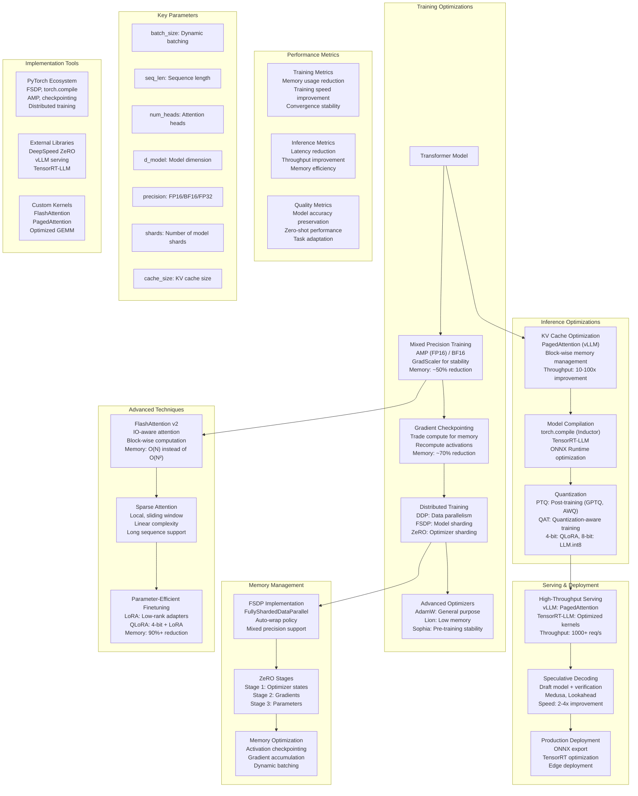

# Advanced SOTA Optimization Flowchart

```mermaid
flowchart TD
    subgraph "Training Optimizations"
        MODEL["Transformer Model"] --> MIXED["Mixed Precision Training\nAMP (FP16) / BF16\nGradScaler for stability\nMemory: ~50% reduction"]
        
        MIXED --> CHECKPOINT["Gradient Checkpointing\nTrade compute for memory\nRecompute activations\nMemory: ~70% reduction"]
        
        CHECKPOINT --> DISTRIBUTED["Distributed Training\nDDP: Data parallelism\nFSDP: Model sharding\nZeRO: Optimizer sharding"]
        
        DISTRIBUTED --> OPTIMIZER["Advanced Optimizers\nAdamW: General purpose\nLion: Low memory\nSophia: Pre-training stability"]
    end
    
    subgraph "Inference Optimizations"
        MODEL --> KV_CACHE["KV Cache Optimization\nPagedAttention (vLLM)\nBlock-wise memory management\nThroughput: 10-100x improvement"]
        
        KV_CACHE --> COMPILE["Model Compilation\ntorch.compile (Inductor)\nTensorRT-LLM\nONNX Runtime optimization"]
        
        COMPILE --> QUANT["Quantization\nPTQ: Post-training (GPTQ, AWQ)\nQAT: Quantization-aware training\n4-bit: QLoRA, 8-bit: LLM.int8"]
    end
    
    subgraph "Memory Management"
        DISTRIBUTED --> FSDP["FSDP Implementation\nFullyShardedDataParallel\nAuto-wrap policy\nMixed precision support"]
        
        FSDP --> ZERO["ZeRO Stages\nStage 1: Optimizer states\nStage 2: Gradients\nStage 3: Parameters"]
        
        ZERO --> MEMORY["Memory Optimization\nActivation checkpointing\nGradient accumulation\nDynamic batching"]
    end
    
    subgraph "Serving & Deployment"
        QUANT --> SERVE["High-Throughput Serving\nvLLM: PagedAttention\nTensorRT-LLM: Optimized kernels\nThroughput: 1000+ req/s"]
        
        SERVE --> SPECULATIVE["Speculative Decoding\nDraft model + verification\nMedusa, Lookahead\nSpeed: 2-4x improvement"]
        
        SPECULATIVE --> DEPLOY["Production Deployment\nONNX export\nTensorRT optimization\nEdge deployment"]
    end
    
    subgraph "Advanced Techniques"
        MIXED --> FLASH["FlashAttention v2\nIO-aware attention\nBlock-wise computation\nMemory: O(N) instead of O(N²)"]
        
        FLASH --> SPARSE["Sparse Attention\nLocal, sliding window\nLinear complexity\nLong sequence support"]
        
        SPARSE --> PEFT["Parameter-Efficient Finetuning\nLoRA: Low-rank adapters\nQLoRA: 4-bit + LoRA\nMemory: 90%+ reduction"]
    end
    
    subgraph "Performance Metrics"
        TRAIN_METRICS["Training Metrics\nMemory usage reduction\nTraining speed improvement\nConvergence stability"]
        
        INFER_METRICS["Inference Metrics\nLatency reduction\nThroughput improvement\nMemory efficiency"]
        
        QUALITY_METRICS["Quality Metrics\nModel accuracy preservation\nZero-shot performance\nTask adaptation"]
    end
    
    subgraph "Key Parameters"
        BATCH["batch_size: Dynamic batching"]
        SEQ_LEN["seq_len: Sequence length"]
        HEADS["num_heads: Attention heads"]
        D_MODEL["d_model: Model dimension"]
        PRECISION["precision: FP16/BF16/FP32"]
        SHARDS["shards: Number of model shards"]
        CACHE_SIZE["cache_size: KV cache size"]
    end
    
    subgraph "Implementation Tools"
        PYTORCH["PyTorch Ecosystem\nFSDP, torch.compile\nAMP, checkpointing\nDistributed training"]
        
        EXTERNAL["External Libraries\nDeepSpeed ZeRO\nvLLM serving\nTensorRT-LLM"]
        
        CUSTOM["Custom Kernels\nFlashAttention\nPagedAttention\nOptimized GEMM"]
    end
```
