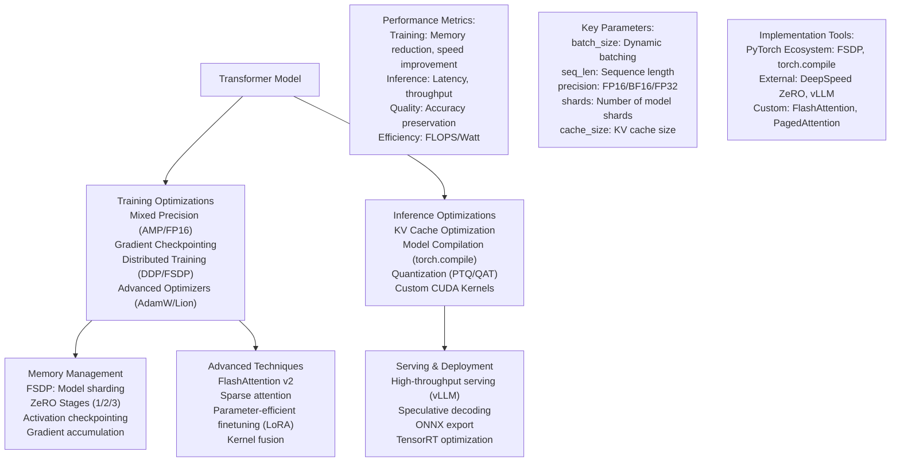

# SOTA Optimization Flowchart

```mermaid
flowchart TD
    A["Transformer Model"] --> B["Training Optimizations\nMixed Precision (AMP/FP16)\nGradient Checkpointing\nDistributed Training (DDP/FSDP)\nAdvanced Optimizers (AdamW/Lion)"]
    
    A --> C["Inference Optimizations\nKV Cache Optimization\nModel Compilation (torch.compile)\nQuantization (PTQ/QAT)\nCustom CUDA Kernels"]
    
    B --> D["Memory Management\nFSDP: Model sharding\nZeRO Stages (1/2/3)\nActivation checkpointing\nGradient accumulation"]
    
    C --> E["Serving & Deployment\nHigh-throughput serving (vLLM)\nSpeculative decoding\nONNX export\nTensorRT optimization"]
    
    B --> F["Advanced Techniques\nFlashAttention v2\nSparse attention\nParameter-efficient finetuning (LoRA)\nKernel fusion"]
    
    G["Performance Metrics:\nTraining: Memory reduction, speed improvement\nInference: Latency, throughput\nQuality: Accuracy preservation\nEfficiency: FLOPS/Watt"]
    
    H["Key Parameters:\nbatch_size: Dynamic batching\nseq_len: Sequence length\nprecision: FP16/BF16/FP32\nshards: Number of model shards\ncache_size: KV cache size"]
    
    I["Implementation Tools:\nPyTorch Ecosystem: FSDP, torch.compile\nExternal: DeepSpeed ZeRO, vLLM\nCustom: FlashAttention, PagedAttention"]
```
