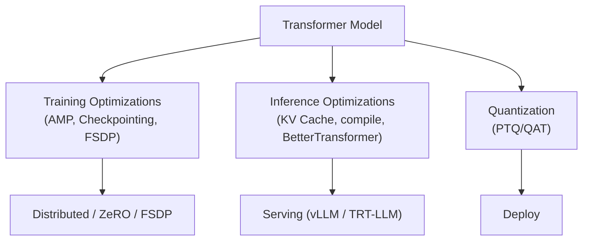

# SOTA Optimization Flowchart

```mermaid
flowchart TD
    MODEL["Transformer Model"] --> TRAIN["Training Optimizations\n(AMP, Checkpointing, FSDP)"]
    MODEL --> INFER["Inference Optimizations\n(KV Cache, compile, BetterTransformer)"]
    MODEL --> QUANT["Quantization\n(PTQ/QAT)"]
    TRAIN --> SCALE["Distributed / ZeRO / FSDP"]
    INFER --> SERVE["Serving (vLLM / TRT-LLM)"]
    QUANT --> DEPLOY["Deploy"]
```
