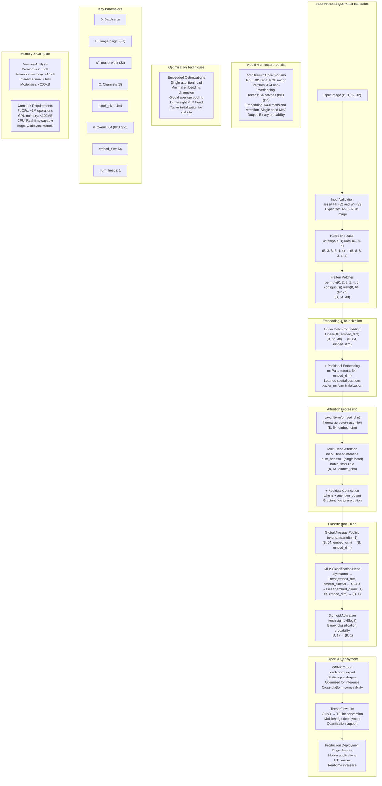

# Advanced Embedded Vision Transformer Flowchart

```mermaid
flowchart TD
    subgraph "Input Processing & Patch Extraction"
        IN["Input Image (B, 3, 32, 32)"] --> VALIDATE["Input Validation\nassert H==32 and W==32\nExpected: 32×32 RGB image"]
        
        VALIDATE --> PATCH_EXTRACT["Patch Extraction\nunfold(2, 4, 4).unfold(3, 4, 4)\n(B, 3, 8, 8, 4, 4) → (B, 8, 8, 3, 4, 4)"]
        
        PATCH_EXTRACT --> PATCH_FLAT["Flatten Patches\npermute(0, 2, 3, 1, 4, 5)\ncontiguous().view(B, 64, 3×4×4)\n(B, 64, 48)"]
    end
    
    subgraph "Embedding & Tokenization"
        PATCH_FLAT --> PATCH_EMBED["Linear Patch Embedding\nLinear(48, embed_dim)\n(B, 64, 48) → (B, 64, embed_dim)"]
        
        PATCH_EMBED --> POS_EMBED["+ Positional Embedding\nnn.Parameter(1, 64, embed_dim)\nLearned spatial positions\nxavier_uniform initialization"]
    end
    
    subgraph "Attention Processing"
        POS_EMBED --> NORM1["LayerNorm(embed_dim)\nNormalize before attention\n(B, 64, embed_dim)"]
        
        NORM1 --> ATTENTION["Multi-Head Attention\nnn.MultiheadAttention\nnum_heads=1 (single head)\nbatch_first=True\n(B, 64, embed_dim)"]
        
        ATTENTION --> RESIDUAL1["+ Residual Connection\ntokens + attention_output\nGradient flow preservation"]
    end
    
    subgraph "Classification Head"
        RESIDUAL1 --> POOLING["Global Average Pooling\ntokens.mean(dim=1)\n(B, 64, embed_dim) → (B, embed_dim)"]
        
        POOLING --> MLP_HEAD["MLP Classification Head\nLayerNorm → Linear(embed_dim, embed_dim×2) → GELU → Linear(embed_dim×2, 1)\n(B, embed_dim) → (B, 1)"]
        
        MLP_HEAD --> SIGMOID["Sigmoid Activation\ntorch.sigmoid(logit)\nBinary classification probability\n(B, 1) → (B, 1)"]
    end
    
    subgraph "Model Architecture Details"
        ARCH["Architecture Specifications\nInput: 32×32×3 RGB image\nPatches: 4×4 non-overlapping\nTokens: 64 patches (8×8 grid)\nEmbedding: 64-dimensional\nAttention: Single head MHA\nOutput: Binary probability"]
    end
    
    subgraph "Optimization Techniques"
        OPT["Embedded Optimizations\nSingle attention head\nMinimal embedding dimension\nGlobal average pooling\nLightweight MLP head\nXavier initialization for stability"]
    end
    
    subgraph "Export & Deployment"
        SIGMOID --> ONNX_EXPORT["ONNX Export\ntorch.onnx.export\nStatic input shapes\nOptimized for inference\nCross-platform compatibility"]
        
        ONNX_EXPORT --> TFLITE["TensorFlow Lite\nONNX → TFLite conversion\nMobile/edge deployment\nQuantization support"]
        
        TFLITE --> DEPLOY["Production Deployment\nEdge devices\nMobile applications\nIoT devices\nReal-time inference"]
    end
    
    subgraph "Key Parameters"
        B["B: Batch size"]
        H["H: Image height (32)"]
        W["W: Image width (32)"]
        C["C: Channels (3)"]
        PATCH_SIZE["patch_size: 4×4"]
        N_TOKENS["n_tokens: 64 (8×8 grid)"]
        EMBED_DIM["embed_dim: 64"]
        NUM_HEADS["num_heads: 1"]
    end
    
    subgraph "Memory & Compute"
        MEMORY["Memory Analysis\nParameters: ~50K\nActivation memory: ~16KB\nInference time: <1ms\nModel size: <200KB"]
        
        COMPUTE["Compute Requirements\nFLOPs: ~1M operations\nGPU memory: <100MB\nCPU: Real-time capable\nEdge: Optimized kernels"]
    end
```
