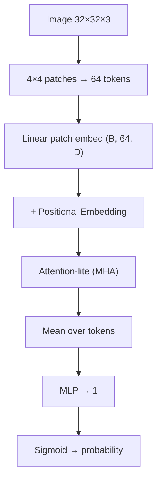

# Embedded Vision Transformer Flowchart

```mermaid
flowchart TD
    IN["Image 32×32×3"] --> PATCH["4×4 patches → 64 tokens"]
    PATCH --> EMBED["Linear patch embed (B, 64, D)"]
    EMBED --> POS["+ Positional Embedding"]
    POS --> ATT["Attention-lite (MHA)"]
    ATT --> POOL["Mean over tokens"]
    POOL --> MLP["MLP → 1"]
    MLP --> PROB["Sigmoid → probability"]
```
