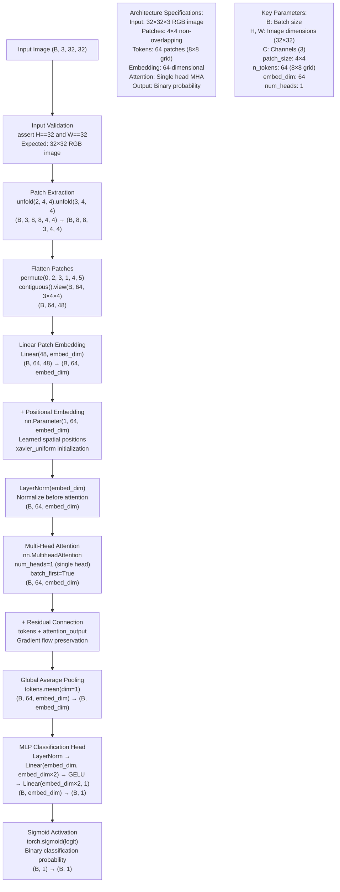

# Embedded Vision Transformer Flowchart

```mermaid
flowchart TD
    A["Input Image (B, 3, 32, 32)"] --> B["Input Validation\nassert H==32 and W==32\nExpected: 32×32 RGB image"]
    
    B --> C["Patch Extraction\nunfold(2, 4, 4).unfold(3, 4, 4)\n(B, 3, 8, 8, 4, 4) → (B, 8, 8, 3, 4, 4)"]
    
    C --> D["Flatten Patches\npermute(0, 2, 3, 1, 4, 5)\ncontiguous().view(B, 64, 3×4×4)\n(B, 64, 48)"]
    
    D --> E["Linear Patch Embedding\nLinear(48, embed_dim)\n(B, 64, 48) → (B, 64, embed_dim)"]
    
    E --> F["+ Positional Embedding\nnn.Parameter(1, 64, embed_dim)\nLearned spatial positions\nxavier_uniform initialization"]
    
    F --> G["LayerNorm(embed_dim)\nNormalize before attention\n(B, 64, embed_dim)"]
    
    G --> H["Multi-Head Attention\nnn.MultiheadAttention\nnum_heads=1 (single head)\nbatch_first=True\n(B, 64, embed_dim)"]
    
    H --> I["+ Residual Connection\ntokens + attention_output\nGradient flow preservation"]
    
    I --> J["Global Average Pooling\ntokens.mean(dim=1)\n(B, 64, embed_dim) → (B, embed_dim)"]
    
    J --> K["MLP Classification Head\nLayerNorm → Linear(embed_dim, embed_dim×2) → GELU → Linear(embed_dim×2, 1)\n(B, embed_dim) → (B, 1)"]
    
    K --> L["Sigmoid Activation\ntorch.sigmoid(logit)\nBinary classification probability\n(B, 1) → (B, 1)"]
    
    M["Architecture Specifications:\nInput: 32×32×3 RGB image\nPatches: 4×4 non-overlapping\nTokens: 64 patches (8×8 grid)\nEmbedding: 64-dimensional\nAttention: Single head MHA\nOutput: Binary probability"]
    
    N["Key Parameters:\nB: Batch size\nH, W: Image dimensions (32×32)\nC: Channels (3)\npatch_size: 4×4\nn_tokens: 64 (8×8 grid)\nembed_dim: 64\nnum_heads: 1"]
```
