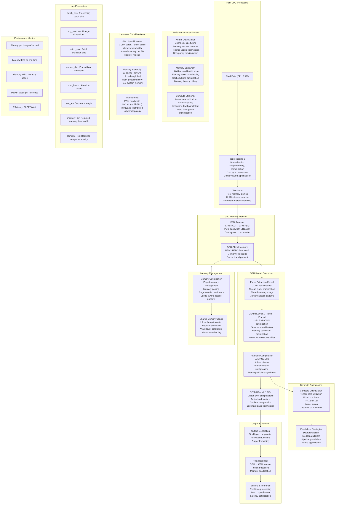

# Advanced Low-Level Compute Flowchart

```mermaid
flowchart TD
    subgraph "Host CPU Processing"
        PIX["Pixel Data (CPU RAM)"] --> PREPROC["Preprocessing & Normalization<br/>Image resizing, normalization<br/>Data type conversion<br/>Memory layout optimization"]
        
        PREPROC --> DMA_SETUP["DMA Setup<br/>Host memory pinning<br/>CUDA stream creation<br/>Memory transfer scheduling"]
    end
    
    subgraph "GPU Memory Transfer"
        DMA_SETUP --> DMA["DMA Transfer<br/>CPU RAM → GPU HBM<br/>PCIe bandwidth utilization<br/>Overlap with computation"]
        
        DMA --> GPU_MEM["GPU Global Memory<br/>HBM2/HBM3 bandwidth<br/>Memory coalescing<br/>Cache line alignment"]
    end
    
    subgraph "GPU Kernel Execution"
        GPU_MEM --> PATCH_EXTRACT["Patch Extraction Kernel<br/>CUDA kernel launch<br/>Thread block organization<br/>Shared memory usage<br/>Memory access patterns"]
        
        PATCH_EXTRACT --> GEMM1["GEMM Kernel 1: Patch → Embed<br/>cuBLAS/cuDNN optimization<br/>Tensor core utilization<br/>Memory bandwidth optimization<br/>Kernel fusion opportunities"]
        
        GEMM1 --> ATTENTION["Attention Computation<br/>Q/K/V GEMMs<br/>Softmax kernel<br/>Attention matrix multiplication<br/>Memory-efficient algorithms"]
        
        ATTENTION --> GEMM2["GEMM Kernel 2: FFN<br/>Linear layer computations<br/>Activation functions<br/>Gradient computation<br/>Backward pass optimization"]
    end
    
    subgraph "Memory Management"
        GPU_MEM --> MEMORY_OPT["Memory Optimization<br/>Paged memory management<br/>Memory pooling<br/>Fragmentation avoidance<br/>Cache-aware access patterns"]
        
        MEMORY_OPT --> SHARED_MEM["Shared Memory Usage<br/>L1 cache optimization<br/>Register allocation<br/>Warp-level parallelism<br/>Memory coalescing"]
    end
    
    subgraph "Compute Optimization"
        ATTENTION --> COMPUTE_OPT["Compute Optimization<br/>Tensor core utilization<br/>Mixed precision (FP16/BF16)<br/>Kernel fusion<br/>Custom CUDA kernels"]
        
        COMPUTE_OPT --> PARALLEL["Parallelism Strategies<br/>Data parallelism<br/>Model parallelism<br/>Pipeline parallelism<br/>Hybrid approaches"]
    end
    
    subgraph "Output & Transfer"
        GEMM2 --> OUTPUT["Output Generation<br/>Final layer computation<br/>Activation functions<br/>Output formatting"]
        
        OUTPUT --> HOST_READBACK["Host Readback<br/>GPU → CPU transfer<br/>Result processing<br/>Memory deallocation"]
        
        HOST_READBACK --> SERVING["Serving & Inference<br/>Real-time processing<br/>Batch optimization<br/>Latency optimization"]
    end
    
    subgraph "Performance Optimization"
        KERNEL_OPT["Kernel Optimization<br/>Grid/block size tuning<br/>Memory access patterns<br/>Register usage optimization<br/>Occupancy maximization"]
        
        MEMORY_BW["Memory Bandwidth<br/>HBM bandwidth utilization<br/>Memory access coalescing<br/>Cache hit rate optimization<br/>Memory latency hiding"]
        
        COMPUTE_EFF["Compute Efficiency<br/>Tensor core utilization<br/>SM occupancy<br/>Instruction-level parallelism<br/>Warp divergence minimization"]
    end
    
    subgraph "Hardware Considerations"
        GPU_SPECS["GPU Specifications<br/>CUDA cores, Tensor cores<br/>Memory bandwidth<br/>Shared memory per SM<br/>Register file size"]
        
        MEMORY_HIERARCHY["Memory Hierarchy<br/>L1 cache (per SM)<br/>L2 cache (global)<br/>HBM global memory<br/>Host system memory"]
        
        INTERCONNECT["Interconnect<br/>PCIe bandwidth<br/>NVLink (multi-GPU)<br/>InfiniBand (distributed)<br/>Network topology"]
    end
    
    subgraph "Key Parameters"
        BATCH_SIZE["batch_size: Processing batch size"]
        IMG_SIZE["img_size: Input image dimensions"]
        PATCH_SIZE["patch_size: Patch extraction size"]
        EMBED_DIM["embed_dim: Embedding dimension"]
        NUM_HEADS["num_heads: Attention heads"]
        SEQ_LEN["seq_len: Sequence length"]
        MEMORY_BW_REQ["memory_bw: Required memory bandwidth"]
        COMPUTE_REQ["compute_req: Required compute capacity"]
    end
    
    subgraph "Performance Metrics"
        THROUGHPUT["Throughput: Images/second"]
        LATENCY["Latency: End-to-end time"]
        MEMORY_USAGE["Memory: GPU memory usage"]
        POWER_EFF["Power: Watts per inference"]
        EFFICIENCY["Efficiency: FLOPS/Watt"]
    end
```
