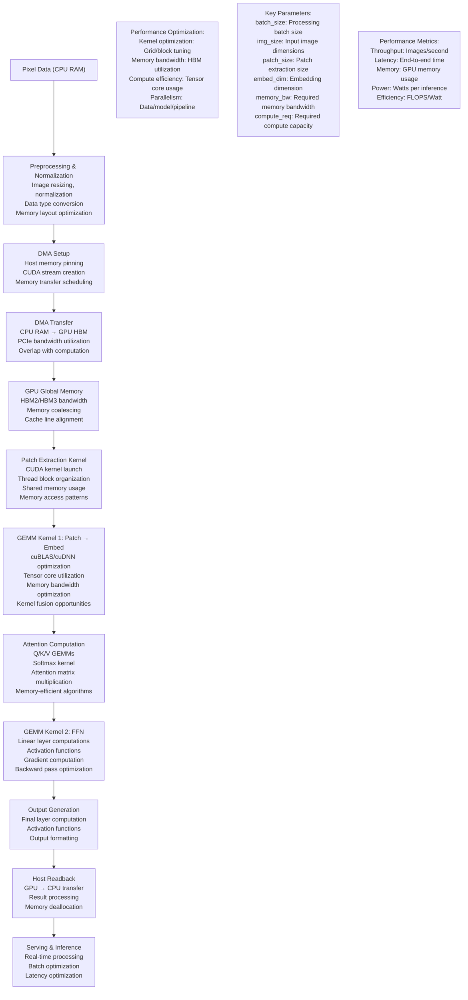

# Low-Level Compute Flowchart

```mermaid
flowchart TD
    A["Pixel Data (CPU RAM)"] --> B["Preprocessing & Normalization\nImage resizing, normalization\nData type conversion\nMemory layout optimization"]
    
    B --> C["DMA Setup\nHost memory pinning\nCUDA stream creation\nMemory transfer scheduling"]
    
    C --> D["DMA Transfer\nCPU RAM → GPU HBM\nPCIe bandwidth utilization\nOverlap with computation"]
    
    D --> E["GPU Global Memory\nHBM2/HBM3 bandwidth\nMemory coalescing\nCache line alignment"]
    
    E --> F["Patch Extraction Kernel\nCUDA kernel launch\nThread block organization\nShared memory usage\nMemory access patterns"]
    
    F --> G["GEMM Kernel 1: Patch → Embed\ncuBLAS/cuDNN optimization\nTensor core utilization\nMemory bandwidth optimization\nKernel fusion opportunities"]
    
    G --> H["Attention Computation\nQ/K/V GEMMs\nSoftmax kernel\nAttention matrix multiplication\nMemory-efficient algorithms"]
    
    H --> I["GEMM Kernel 2: FFN\nLinear layer computations\nActivation functions\nGradient computation\nBackward pass optimization"]
    
    I --> J["Output Generation\nFinal layer computation\nActivation functions\nOutput formatting"]
    
    J --> K["Host Readback\nGPU → CPU transfer\nResult processing\nMemory deallocation"]
    
    K --> L["Serving & Inference\nReal-time processing\nBatch optimization\nLatency optimization"]
    
    M["Performance Optimization:\nKernel optimization: Grid/block tuning\nMemory bandwidth: HBM utilization\nCompute efficiency: Tensor core usage\nParallelism: Data/model/pipeline"]
    
    N["Key Parameters:\nbatch_size: Processing batch size\nimg_size: Input image dimensions\npatch_size: Patch extraction size\nembed_dim: Embedding dimension\nmemory_bw: Required memory bandwidth\ncompute_req: Required compute capacity"]
    
    O["Performance Metrics:\nThroughput: Images/second\nLatency: End-to-end time\nMemory: GPU memory usage\nPower: Watts per inference\nEfficiency: FLOPS/Watt"]
```
