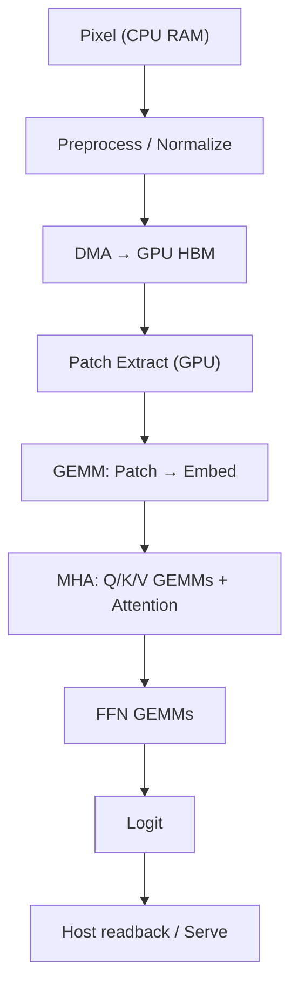

# Low-Level Compute Flowchart

```mermaid
flowchart TD
    PIX["Pixel (CPU RAM)"] --> PRE["Preprocess / Normalize"]
    PRE --> DMA["DMA → GPU HBM"]
    DMA --> PATCH["Patch Extract (GPU)"]
    PATCH --> GEMM1["GEMM: Patch → Embed"]
    GEMM1 --> MHA["MHA: Q/K/V GEMMs + Attention"]
    MHA --> FFN["FFN GEMMs"]
    FFN --> LOGIT["Logit"]
    LOGIT --> OUT["Host readback / Serve"]
```
